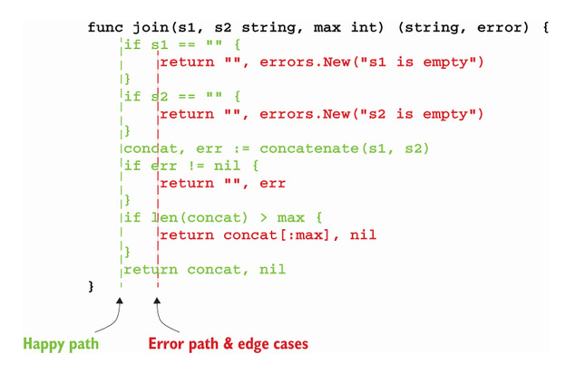
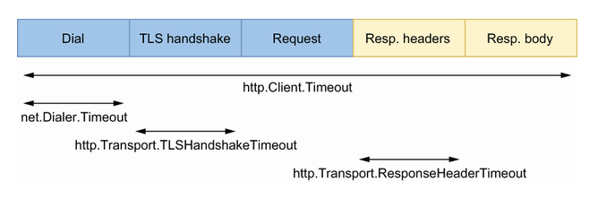
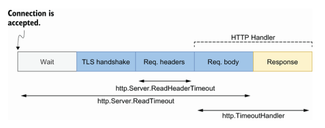

# go-mistakes

## Unintended variable shadowing

Declares outer block variable and then redeclare the same name variable in an inner block,
after prcess the inner block, the outer block variable will stay the same.\
\
**Solution:** To assign value to the outer block variable in the inner block, just use `=` not `:=`

## Unnecessary nested code

Because it was difficult to distinguish the expected execution flow because of the nested if/else statements. Conversely, if only one nested if/else statment, it requires scanning down one column to see the expected execution flow and down the second column to see how the edge cases are handled.\
\
\
\
To understand the expected execution flow, we just have to scan the happy path column.\
\
**Solution:** Striving to reduce the number of nested blocks, aligning the happy path on the left, and returning as early as possible are concrete means to improve our code’s readability.

## Interface on the producer side

*abstractions should be discovered, not created.* This means that it’s not up to the producer to force a given abstraction for all the clients. Instead, it’s up to the client to decide whether it needs some form of abstraction and then determine the best abstraction level for its needs.\
\
`time.Time` field contain monotonic time An interface should live on the consumer side in most cases. However, in particular contexts (for example, when we know—not foresee—that an abstraction will be helpful for consumers), we may want to have it on the producer side. If we do, we should strive to keep it as minimal as possible, increasing its reusability potential and making it more easily composable.\
\
**Note:** The interface in Go is satisfied implicitly while some is an explicit implementation which have to declare that a particular class or type explicitly implements a specific interface and cannot do like solution above.

## Not knowing which type of receiver to use

### A receiver must be a pointer

* If the method needs to mutate the receiver. This rule is also valid if the receiver is a slice and a method needs to append elements.
* If the method receiver contains a field that cannot be copied: for example, a type part of the `sync` package.

### A receiver should be a pointer

* If the receiver is a large object. Using a pointer can make the call more efficient, as doing so prevents making an extensive copy. When in doubt about how large is large, benchmarking can be the solution; it’s pretty much impossible to state a specific size, because it depends on many factors.

### A receiver must be a value

* If we have to enforce a receiver’s immutability.
* If the receiver is a map, function, or channel. Otherwise, a compilation error occurs.

### A receiver should be a value

* If the receiver is a slice that doesn’t have to be mutated.
* If the receiver is a small array or struct that is naturally a value type without mutable fields, such as `time.Time`.
* If the receiver is a basic type such as `int`, `float64`, or `string`.

## Common JSON-handling mistakes

### Unexpected behavior due to type embedding

 If an embedded field type implements an interface, the struct containing the embedded field will also implement this interface. We should be careful with embedded fields. While promoting the fields and methods of an embedded field type can sometimes be convenient, it can also lead to subtle bugs because it can make the parent struct implement interfaces without a clear signal. Again, when using embedded fields

 ### JSON and the monotonic clock

```
2021-01-10 17:13:08.852061 +0100 CET m=+0.000338660
------------------------------------ --------------
             Wall time               Monotonic time
```

When marshal `time.Time` field contain monotonic time while unmarshal `time.Time` field doesn't contain monotonic time. The marshaling/unmarshaling process isn’t always symmetric, and we faced this case with a struct containing a time.Time.\
\
**Solution:** Use the `Equal` method instead of `==` or stay `==` but use `Truncate` method to time before marshal.

### Map of any

```
b := getMessage()
var m map[string]any
err := json.Unmarshal(b, &m)
if err != nil {
    return err
}
```

If we use a map of any: any numeric value, regardless of whether it contains a decimal, is converted into a float64 type.

## Common SQL mistakes

The `database/sql` package provides a generic interface around SQL (or SQL-like) databases. It’s also fairly common to see some patterns or mistakes while using this package. Let’s delve into five common mistakes.

###  Forgetting that sql.Open doesn’t necessarily establish connections to a database

When using sql.Open, one common misconception is expecting this function to establish connections to a database:

```
db, err := sql.Open("mysql", dsn)
if err != nil {
    return err
}
```

But this isn’t necessarily the case. According to the documentation (https://pkg.go.dev/database/sql),
\
*Open may just validate its arguments without creating a connection to the database.*\
\
Actually, the behavior depends on the SQL driver used. For some drivers, sql.Open doesn’t establish a connection: it’s only a preparation for later use (for example, with db.Query). Therefore, the first connection to the database may be established lazily.\
\
Why do we need to know about this behavior? For example, in some cases, we want to make a service ready only after we know that all the dependencies are correctly set up and reachable. If we don’t know this, the service may accept traffic despite an erroneous configuration.\
\
If we want to ensure that the function that uses sql.Open also guarantees that the underlying database is reachable, we should use the Ping method:

```
db, err := sql.Open("mysql", dsn)
if err != nil {
    return err
}
if err := db.Ping(); err != nil {     ❶
    return err
}
```

❶ Calls the Ping method following sql.Open\
\
Ping forces the code to establish a connection that ensures that the data source name is valid and the database is reachable. Note that an alternative to Ping is PingContext, which asks for an additional context conveying when the ping should be canceled or time out.\
\
Despite being perhaps counterintuitive, let’s remember that sql.Open doesn’t necessarily establish a connection, and the first connection can be opened lazily. If we want to test our configuration and be sure a database is reachable, we should follow sql.Open with a call to the Ping or PingContext method.

### Forgetting about connections pooling

Just as the default HTTP client and server provide default behaviors that may not be effective in production (see mistake #81, “Using the default HTTP client and server”), it’s essential to understand how database connections are handled in Go. sql.Open returns an *sql.DB struct. This struct doesn’t represent a single database connection; instead, it represents a pool of connections. This is worth noting so we’re not tempted to implement it manually. A connection in the pool can have two states:

* Already used (for example, by another goroutine that triggers a query)
* Idle (already created but not in use for the time being)

It’s also important to remember that creating a pool leads to four available config parameters that we may want to override. Each of these parameters is an exported method of `*sql.DB`:

* SetMaxOpenConns—Maximum number of open connections to the database (default value: unlimited)
* SetMaxIdleConns—Maximum number of idle connections (default value: 2)
* SetConnMaxIdleTime—Maximum amount of time a connection can be idle before it’s closed (default value: unlimited)
* SetConnMaxLifetime—Maximum amount of time a connection can be held open before it’s closed (default value: unlimited)

Figure shows an example with a maximum of five connections. It has four ongoing connections: three idle and one in use. Therefore, one slot remains available for an extra connection. If a new query comes in, it will pick one of the idle connections (if still available). If there are no more idle connections, the pool will create a new connection if an extra slot is available; otherwise, it will wait until a connection is available.\
\
\
\
A connection pool with five connections\
\
So, why should we tweak these config parameters?

* Setting SetMaxOpenConns is important for production-grade applications. Because the default value is unlimited, we should set it to make sure it fits what the underlying database can handle.
* The value of SetMaxIdleConns (default: 2) should be increased if our application generates a significant number of concurrent requests. Otherwise, the application may experience frequent reconnects.
* Setting SetConnMaxIdleTime is important if our application may face a burst of requests. When the application returns to a more peaceful state, we want to make sure the connections created are eventually released.
* Setting SetConnMaxLifetime can be helpful if, for example, we connect to a load-balanced database server. In that case, we want to ensure that our application never uses a connection for too long.

For production-grade applications, we must consider these four parameters. We can also use multiple connection pools if an application faces different use cases.

### Not using prepared statements

A prepared statement is a feature implemented by many SQL databases to execute a repeated SQL statement. Internally, the SQL statement is precompiled and separated from the data provided. There are two main benefits:

* Efficiency—The statement doesn’t have to be recompiled (compilation means parsing + optimization + translation).
* Security—This approach reduces the risks of SQL injection attacks.

Therefore, if a statement is repeated, we should use prepared statements. We should also use prepared statements in untrusted contexts (such as exposing an endpoint on the internet, where the request is mapped to an SQL statement).\
\
To use prepared statements, instead of calling the Query method of *sql.DB, we call Prepare:

```
stmt, err := db.Prepare("SELECT * FROM ORDER WHERE ID = ?")   ❶
if err != nil {
    return err
}
rows, err := stmt.Query(id)                                   ❷
// ...
```

❶ Prepares the statement\
\
❷ Executes the prepared query\
\
We prepare the statement and then execute it while providing the arguments. The first output of the Prepare method is an *sql.Stmt, which can be reused and run concurrently. When the statement is no longer needed, it must be closed using the Close() method.\
\
**NOTE** The Prepare and Query methods have alternatives to provide an additional context: PrepareContext and QueryContext.\
\
For efficiency and security, we need to remember to use prepared statements when it makes sense.

### Mishandling null values

The next mistake is to mishandle null values with queries. Let’s write an example where we retrieve the department and age of an employee:

```
rows, err := db.Query("SELECT DEP, AGE FROM EMP WHERE ID = ?", id)    ❶
if err != nil {
    return err
}
// Defer closing rows
 
var (
    department string
    age int
)
for rows.Next() {
    err := rows.Scan(&department, &age)                               ❷
    if err != nil {
        return err
    }
    // ...
}
```

❶ Executes the query\
\
❷ Scans each row\
\
We use Query to execute a query. Then, we iterate over the rows and use Scan to copy the column into the values pointed to by the `department` and `age` pointers. If we run this example, we may get the following error while calling Scan:

```
2021/10/29 17:58:05 sql: Scan error on column index 0, name "DEPARTMENT":
converting NULL to string is unsupported
```

Here, the SQL driver raises an error because the department value is equal to NULL. If a column can be nullable, there are two options to prevent Scan from returning an error.\
\
The first approach is to declare department as a string pointer:

```
var (
    department *string      ❶
    age        int
)
for rows.Next() {
    err := rows.Scan(&department, &age)
    // ...
}
```

❶ Changing the type from string to *string\
\
We provide scan with the address of a pointer, not the address of a string type directly. By doing so, if the value is `NULL`, `department` will be `nil`.\
\
The other approach is to use one of the sql.NullXXX types, such as sql.NullString:

```
var (
    department sql.NullString    ❶
    age        int
)
for rows.Next() {
    err := rows.Scan(&department, &age)
    // ...
}
```

❶ Changes the type to sql.NullString\
\
sql.NullString is a wrapper on top of a string. It contains two exported fields: String contains the string value, and Valid conveys whether the string isn’t NULL. The following wrappers are accessible:

* `sql.NullString`
* `sql.NullBool`
* `sql.NullInt32`
* `sql.NullInt64`
* `sql.NullFloat64`
* `sql.NullTime`

Both approaches work, with `sql.NullXXX` expressing the intent more clearly, as mentioned by Russ Cox, a core Go maintainer (http://mng.bz/rJNX):\
\
There’s no effective difference. We thought people might want to use NullString because it is so common and perhaps expresses the intent more clearly than *string. But either will work.\
\
So, the best practice with a nullable column is to either handle it as a pointer or use an sql.NullXXX type.

### Not handling row iteration errors

Another common mistake is to miss possible errors from iterating over rows. Let’s look at a function where error handling is misused:

```
func get(ctx context.Context, db *sql.DB, id string) (string, int, error) {
    rows, err := db.QueryContext(ctx,
        "SELECT DEP, AGE FROM EMP WHERE ID = ?", id)
    if err != nil {                                     ❶
        return "", 0, err
    }
    defer func() {
        err := rows.Close()                             ❷
        if err != nil {
            log.Printf("failed to close rows: %v\n", err)
        }
    }()
 
    var (
        department string
        age        int
    )
    for rows.Next() {
        err := rows.Scan(&department, &age)             ❸
        if err != nil {
            return "", 0, err
        }
    }
 
    return department, age, nil
}
```

❶ Handles errors while executing the query\
\
❷ Handles errors while closing the rows\
\
❸ Handles errors while scanning a row\
\
In this function, we handle three errors: while executing the query, closing the rows, and scanning a row. But this isn’t enough. We have to know that the for `rows.Next()` `{}` loop can break either when there are no more rows or when an error happens while preparing the next row. Following a row iteration, we should call `rows.Err` to distinguish between the two cases:

```
func get(ctx context.Context, db *sql.DB, id string) (string, int, error) {
    // ...
    for rows.Next() {
        // ...
    }
 
    if err := rows.Err(); err != nil {    ❶
        return "", 0, err
    }
 
    return department, age, nil
}
```

❶ Checks rows.Err to determine whether the previous loop stopped because of an error\
\
This is the best practice to keep in mind: because rows.Next can stop either when we have iterated over all the rows or when an error happens while preparing the next row, we should check rows.Err following the iteration.\
\
Let’s now discuss a frequent mistake: forgetting to close transient resources.

## Not closing transient resources

Pretty frequently, developers work with transient (temporary) resources that must be closed at some point in the code: for example, to avoid leaks on disk or in memory. Structs can generally implement the io.Closer interface to convey that a transient resource has to be closed. Let’s look at three common examples of what happens when resources aren’t correctly closed and how to handle them properly.

### HTTP body

First, let’s discuss this problem in the context of HTTP. We will write a getBody method that makes an HTTP GET request and returns the HTTP body response. Here’s a first implementation:

```
type handler struct {
    client http.Client
    url    string
}
 
func (h handler) getBody() (string, error) {
    resp, err := h.client.Get(h.url)           ❶
    if err != nil {
        return "", err
    }
 
    body, err := io.ReadAll(resp.Body)         ❷
    if err != nil {
        return "", err
    }
 
    return string(body), nil
}
```

❶ Makes an HTTP GET request\
\
❷ Reads resp.Body and gets a body as a []byte\
\
We use http.Get and parse the response using io.ReadAll. This method looks OK, and it correctly returns the HTTP response body. However, there’s a resource leak. Let’s understand where.\
\
resp is an *http.Response type. It contains a Body io.ReadCloser field (io.ReadCloser implements both io.Reader and io.Closer). This body must be closed if http.Get doesn’t return an error; otherwise, it’s a resource leak. In this case, our application will keep some memory allocated that is no longer needed but can’t be reclaimed by the GC and may prevent clients from reusing the TCP connection in the worst cases.\
\
The most convenient way to deal with body closure is to handle it as a defer statement this way:

```
defer func() {
    err := resp.Body.Close()
    if err != nil {
        log.Printf("failed to close response: %v\n", err)
    }
}()
```

In this implementation, we properly handle the body resource closure as a defer function that will be executed once getBody returns.\
\
**NOTE** On the server side, while implementing an HTTP handler, we aren’t required to close the request body because the server does this automatically.\
\
We should also understand that a response body must be closed regardless of whether we read it. For example, if we are only interested in the HTTP status code and not in the body, it has to be closed no matter what, to avoid a leak:

```
func (h handler) getStatusCode(body io.Reader) (int, error) {
    resp, err := h.client.Post(h.url, "application/json", body)
    if err != nil {
        return 0, err
    }
 
    defer func() {                ❶
        err := resp.Body.Close()
        if err != nil {
            log.Printf("failed to close response: %v\n", err)
        }
    }()
 
    return resp.StatusCode, nil
}
```

❶ Closes the response body even if we don’t read it\
\
This function closes the body even though we haven’t read it.\
\
Another essential thing to remember is that the behavior is different when we close the body, depending on whether we have read from it:

* If we close the body without a read, the default HTTP transport may close the connection.
* If we close the body following a read, the default HTTP transport won’t close the connection; hence, it may be reused.

Therefore, if getStatusCode is called repeatedly and we want to use keep-alive connections, we should read the body even though we aren’t interested in it:

```
func (h handler) getStatusCode(body io.Reader) (int, error) {
    resp, err := h.client.Post(h.url, "application/json", body)
    if err != nil {
        return 0, err
    }
 
    // Close response body
 
    _, _ = io.Copy(io.Discard, resp.Body)     ❶
 
    return resp.StatusCode, nil
}
```

❶ Reads the response body\
\
In this example, we read the body to keep the connection alive. Note that instead of using io.ReadAll, we used io.Copy to io.Discard, an io.Writer implementation. This code reads the body but discards it without any copy, making it more efficient than io.ReadAll.\
\
When to close the response body\
\
Fairly frequently, implementations close the body if the response isn’t empty, not if the error is nil:

```
resp, err := http.Get(url)
if resp != nil {                ❶
    defer resp.Body.Close()     ❷
}
 
if err != nil {
    return "", err
}
```

❶ If the response isn’t nil ...\
\
❷ ... close the response body as a defer function.\
\
\
This implementation isn’t necessary. It’s based on the fact that in some conditions (such as a redirection failure), neither resp nor err will be nil. But according to the official Go documentation (https://pkg.go.dev/net/http),\
\
On error, any Response can be ignored. A non-nil Response with a non-nil error only occurs when CheckRedirect fails, and even then, the returned Response.Body is already closed.\
\
Therefore, the `if resp != nil {}` check isn’t necessary. We should stick with the initial solution that closes the body in a `defer` function only if there is no error.\
\
Closing a resource to avoid leaks isn’t only related to HTTP body management. In general, all structs implementing the io.Closer interface should be closed at some point. This interface contains a single Close method:

```
type Closer interface {
    Close() error
}
```

Let’s now see the impacts with `sql.Rows`.

### sql.Rows

sql.Rows is a struct used as a result of an SQL query. Because this struct implements io.Closer, it has to be closed. The following example omits closing the rows:

```
db, err := sql.Open("postgres", dataSourceName)
if err != nil {
    return err
}
 
rows, err := db.Query("SELECT * FROM CUSTOMERS")    ❶
if err != nil {
    return err
}

// Use rows
 
return nil
```

❶ Performs the SQL query\
\
Forgetting to close the rows means a connection leak, which prevents the database connection from being put back into the connection pool.\
\
We can handle the closure as a `defer` function following the `if err != nil block`:

```
// Open connection
 
rows, err := db.Query("SELECT * FROM CUSTOMERS")     ❶
if err != nil {
    return err
}
 
defer func() {                                       ❷
    if err := rows.Close(); err != nil {
        log.Printf("failed to close rows: %v\n", err)
    }
}()
 
// Use rows
```

❶ Performs an SQL query\
\
❷ Closes the rows\
\
Following the `Query` call, we should eventually close `rows` to prevent a connection leak if it doesn’t return an error.\
\
**NOTE** As discussed in the previous section, the db variable (*sql.DB type) represents a pool of connections. It also implements the io.Closer interface. But as the documentation suggests, it is rare to close an sql.DB because it’s meant to be long-lived and shared among many goroutines.\
\
Next, let’s discuss closing resources while working with files.

### os.File

os.File represents an open file descriptor. Like sql.Rows, it must be closed eventually:

```
f, err := os.OpenFile(filename, os.O_APPEND|os.O_WRONLY, os.ModeAppend)   ❶
if err != nil {
    return err
}
 
defer func() {
    if err := f.Close(); err != nil {                                     ❷
        log.Printf("failed to close file: %v\n", err)
    }
}()
```

❶ Opens the file\
\
❷ Closes the file descriptor\
\
In this example, we use defer to defer the call to the Close method. If we don’t eventually close an os.File, it will not lead to a leak per se: the file will be closed automatically when os.File is garbage collected. However, it’s better to call Close explicitly because we don’t know when the next GC will be triggered (unless we manually run it).\
\
There’s another benefit of calling Close explicitly: to actively monitor the error that is returned. For example, this should be the case with writable files.\
\
Writing to a file descriptor isn’t a synchronous operation. For performance concerns, data is buffered. The BSD manual page for close(2) mentions that a closure can lead to an error in a previously uncommitted write (still living in a buffer) encountered during an I/O error. For that reason, if we want to write to a file, we should propagate any error that occurs while closing the file:

```
func writeToFile(filename string, content []byte) (err error) {
    // Open file
 
    defer func() {             ❶
        closeErr := f.Close()
        if err == nil {
            err = closeErr
        }
    }()
 
    _, err = f.Write(content)
    return
}
```

❶ Returns the close error if the write succeeds\
\
In this example, we use named arguments and set the error to the response of f.Close if the write succeeds. This way, clients will be aware if something goes wrong with this function and can react accordingly.\
\
Furthermore, success while closing a writable os.File doesn’t guarantee that the file will be written on disk. The write can still live in a buffer on the filesystem and not be flushed on disk. If durability is a critical factor, we can use the Sync() method to commit a change. In that case, errors coming from Close can be safely ignored:

```
func writeToFile(filename string, content []byte) error {
    // Open file
 
    defer func() {
        _ = f.Close()       ❶
    }()
 
    _, err = f.Write(content)
    if err != nil {
        return err
    }
 
    return f.Sync()         ❷
}
```

❶ Ignores possible errors\
\
❷ Commits the write to the disk\
\
This example is a synchronous write function. It ensures that the content is written to disk before returning. But its downside is an impact on performance.\
\
To summarize this section, we’ve seen how important it is to close ephemeral resources and thus avoid leaks. Ephemeral resources must be closed at the right time and in specific situations. It’s not always clear up front what has to be closed. We can only acquire this information by carefully reading the API documentation and/or through experience. But we should remember that if a struct implements the io.Closer interface, we must eventually call the Close method. Last but not least, it’s essential to understand what to do if a closure fails: is it enough to log a message, or should we also propagate it? The appropriate action depends on the implementation, as seen in the three examples in this section.\
\
Let’s now switch to common mistakes related to HTTP handling: forgetting `return` statements.

## Forgetting the return statement after replying to an HTTP request

While writing an HTTP handler, it’s easy to forget the `return` statement after replying to an HTTP request. This may lead to an odd situation where we should have stopped a handler after an error, but we didn’t.\
\
We can observe this situation in the following example:

```
func handler(w http.ResponseWriter, req *http.Request) {
    err := foo(req)
    if err != nil {
        http.Error(w, "foo", http.StatusInternalServerError)    ❶
    }
 
    // ...
}
```

❶ Handles the error\
\
If `foo` returns an error, we handle it using `http.Error`, which replies to the request with the `foo` error message and a 500 Internal Server Error. The problem with this code is that if we enter the `if err != nil` branch, the application will continue its execution, because `http.Error` doesn’t stop the handler’s execution.\
\
What’s the real impact of such an error? First, let’s discuss it at the HTTP level. For example, suppose we had completed the previous HTTP handler by adding a step to write a successful HTTP response body and status code:

```
func handler(w http.ResponseWriter, req *http.Request) {
    err := foo(req)
    if err != nil {
        http.Error(w, "foo", http.StatusInternalServerError)
    }
 
    _, _ = w.Write([]byte("all good"))
    w.WriteHeader(http.StatusCreated)
}
```

In the case err != nil, the HTTP response would be the following:

```
foo
all good
```

The response contains both the error and success messages.\
\
We would return only the first HTTP status code: in the previous example, 500. However, Go would also log a warning:

```
2021/10/29 16:45:33 http: superfluous response.WriteHeader call
from main.handler (main.go:20)
```

This warning means we tried to write the status code multiple times and doing so was superfluous.\
\
In terms of execution, the main impact would be to continue the execution of a function that should have been stopped. For example, if foo was returning a pointer in addition to the error, continuing execution would mean using this pointer, perhaps leading to a nil pointer dereference (and hence a goroutine panic).\
\
The fix for this mistake is to keep thinking about adding the `return` statement following `http.Error`:

```
func handler(w http.ResponseWriter, req *http.Request) {
    err := foo(req)
    if err != nil {
        http.Error(w, "foo", http.StatusInternalServerError)
        return    ❶
    }
 
    // ...
}
```

❶ Adds the return statement\
\
Thanks to the `return` statement, the function will stop its execution if we end in the `if err != nil` branch.\
\
This error is probably not the most complex of this book. Yet, it’s so easy to forget about it that this mistake occurs fairly frequently. We always need to remember that `http.Error` doesn’t stop a handler execution and must be added manually. Such an issue can and should be caught during testing if we have decent coverage.\
\
The last section of this chapter continues our discussion of HTTP. We see why production-grade applications shouldn’t rely on the default HTTP client and server implementations.

## Using the default HTTP client and server

The `http` package provides HTTP client and server implementations. However, it’s all too easy for developers to make a common mistake: relying on the default implementations in the context of applications that are eventually deployed in production. Let’s look at the problems and how to overcome them.

### HTTP client

Let’s define what default client means. We will use a GET request as an example. We can use the zero value of an `http.Client` struct like so:

```
client := &http.Client{}
resp, err := client.Get("https://golang.org/")
```

Or we can use the http.Get function:

```
resp, err := http.Get("https://golang.org/")
```

In the end, both approaches are the same. The `http.Get` function uses `http.DefaultClient`, which is also based on the zero value of `http.Client`:

```
// DefaultClient is the default Client and is used by Get, Head, and Post.
var DefaultClient = &Client{}
```

So, what’s the problem with using the default HTTP client?\
\
First, the default client doesn’t specify any timeouts. This absence of timeout is not something we want for production-grade systems: it can lead to many issues, such as never-ending requests that could exhaust system resources.\
\
Before delving into the available timeouts while making a request, let’s review the five steps involved in an HTTP request:

* Dial to establish a TCP connection.
* TLS handshake (if enabled).
* Send the request.
* Read the response headers.
* Read the response body.

Figure shows how these steps relate to the main client timeouts.\
\
\
\
The five steps during an HTTP request, and the related timeouts\
\
The four main timeouts are the following:

* `net.Dialer.Timeout`—Specifies the maximum amount of time a dial will wait for a connection to complete.
* `http.Transport.TLSHandshakeTimeout`—Specifies the maximum amount of time to wait for the TLS handshake.
* `http.Transport.ResponseHeaderTimeout`—Specifies the amount of time to wait for a server’s response headers.
* `http.Client.Timeout`—Specifies the time limit for a request. It includes all the steps, from step 1 (dial) to step 5 (read the response body).

HTTP client timeout\
\
You may have encountered the following error when specifying `http.Client.Timeout`:

```
net/http: request canceled (Client.Timeout exceeded while awaiting headers)
```

This error means the endpoint failed to respond on time. We get this error about headers because reading them is the first step while waiting for a response.\
\
Here’s an example of an HTTP client that overrides these timeouts:

```
client := &http.Client{
    Timeout: 5 * time.Second,                  ❶
    Transport: &http.Transport{
        DialContext: (&net.Dialer{
            Timeout: time.Second,              ❷
        }).DialContext,
        TLSHandshakeTimeout:   time.Second,    ❸
        ResponseHeaderTimeout: time.Second,    ❹
    },
}
```

❶ Global request timeout\
\
❷ Dial timeout\
\
❸ TLS handshake timeout\
\
❹ Response header timeout\
\
We create a client with a 1-second timeout for the dial, the TLS handshake, and reading the response header. Meanwhile, each request has a global 5-second timeout.\
\
The second aspect to bear in mind about the default HTTP client is how connections are handled. By default, the HTTP client does connection pooling. The default client reuses connections (it can be disabled by setting `http.Transport.DisableKeepAlives` to `true`). There’s an extra timeout to specify how long an idle connection is kept in the pool: `http.Transport.IdleConnTimeout`. The default value is 90 seconds, which means the connection can be reused for other requests during this time. After that, if the connection hasn’t been reused, it will be closed.\
\
To configure the number of connections in the pool, we must override `http.Transport.MaxIdleConns`. This value is set to `100` by default. But there’s something important to note: the `http.Transport.MaxIdleConnsPerHost` limit per host, which by default is set to 2. For example, if we trigger `100` requests to the same host, only 2 connections will remain in the connection pool after that. Hence, if we trigger 100 requests again, we will have to reopen at least 98 connections. This configuration can also impact the average latency if we have to deal with a significant number of parallel requests to the same host.\
\
For production-grade systems, we probably want to override the default timeouts. And tweaking the parameters related to connection pooling can also have a significant impact on the latency.

### HTTP server

We should also be careful while implementing an HTTP server. Again, a default server can be created using the zero value of `http.Server`:

```
server := &http.Server{}
server.Serve(listener)
```

Or we can use a function such as `http.Serve`, `http.ListenAndServe`, or `http.ListenAndServeTLS` that also relies on the default `http.Server`.\
\
Once a connection is accepted, an HTTP response is divided into five steps:

1. Wait for the client to send the request.
1. TLS handshake (if enabled).
1. Read the request headers.
1. Read the request body.
1. Write the response.

**NOTE** The TLS handshake doesn’t have to be repeated with an already established connection.\
\
Figure shows how these steps relate to the main server timeouts. The three main timeouts are the following:

* `http.Server.ReadHeaderTimeout`—A field that specifies the maximum amount of time to read the request headers
* `http.Server.ReadTimeout`—A field that specifies the maximum amount of time to read the entire request
* `http.TimeoutHandler`—A wrapper function that specifies the maximum amount of time for a handler to complete
\
\
\
The five steps of an HTTP response, and the related timeouts\
\
The last parameter isn’t a server parameter but a wrapper on top of a handler to limit its duration. If a handler fails to respond on time, the server will reply 503 Service Unavailable with a specific message, and the context passed to the handler will be canceled.
\
**NOTE** We purposely omitted http.Server.WriteTimeout, which isn’t necessary since http.TimeoutHandler was released (Go 1.8). http.Server.WriteTimeout has a few issues. First, its behavior depends on whether TLS is enabled, making it more complex to understand and use. It also closes the TCP connection without returning a proper HTTP code if the timeout is reached. And it doesn’t propagate the cancellation to the handler context, so a handler may continue its execution without knowing that the TCP connection is already closed.\
\
While exposing our endpoint to untrusted clients, the best practice is to set at least the http.Server.ReadHeaderTimeout field and use the http.TimeoutHandler wrapper function. Otherwise, clients may exploit this flaw and, for example, create never-ending connections that can lead to exhaustion of system resources.\
\
Here’s how to set up a server with these timeouts in place:

```
s := &http.Server{
    Addr:              ":8080",
    ReadHeaderTimeout: 500 * time.Millisecond,
    ReadTimeout:       500 * time.Millisecond,
    Handler:           http.TimeoutHandler(handler, time.Second, "foo"),   ❶
}
```

❶ Wraps the HTTP handler\
\
http.TimeoutHandler wraps the provided handler. Here, if handler fails to respond in 1 second, the server returns a 503 status code with foo as the HTTP response.\
\
Just as we described regarding HTTP clients, on the server side we can configure the maximum amount of time for the next request when keep-alives are enabled. We do so using http.Server.IdleTimeout:

```
s := &http.Server{
    // ...
    IdleTimeout: time.Second,
}
```

**Note** that if http.Server.IdleTimeout isn’t set, the value of http.Server.ReadTimeout is used for the idle timeout. If neither is set, there won’t be any timeouts, and connections will remain open until they are closed by clients.\
\
For production-grade applications, we need to make sure not to use default HTTP clients and servers. Otherwise, requests may be stuck forever due to an absence of time- outs or even malicious clients that exploit the fact that our server doesn’t have any timeouts.

## Not using testing utility packages

Unaware of these packages and trying to reinvent the wheel or rely on other solutions that aren’t as handy.

### The httptest package

The [httptest](https://pkg.go.dev/net/http/httptest) package provides utilities for HTTP testing for both clients and servers. Let’s look at these two use cases.\
\
First, let’s see how `httptest` can help us while writing an HTTP server. We will implement a handler that performs some basic actions: writing a header and body, and returning a specific status code. For the sake of clarity, we will omit error handling:

```
func Handler(w http.ResponseWriter, r *http.Request) {
    w.Header().Add("X-API-VERSION", "1.0")
    b, _ := io.ReadAll(r.Body)
    _, _ = w.Write(append([]byte("hello "), b...))     ❶
    w.WriteHeader(http.StatusCreated)
}
```

❶ Concatenates hello with the request body\
\
An HTTP handler accepts two arguments: the request and a way to write the response. The `httptest` package provides utilities for both. For the request, we can use `httptest.NewRequest` to build an `*http.Request` using an HTTP method, a URL, and a body. For the response, we can use `httptest.NewRecorder` to record the mutations made within the handler. Let’s write a unit test of this handler:

```
func TestHandler(t *testing.T) {
    req := httptest.NewRequest(http.MethodGet, "http://localhost",     ❶
        strings.NewReader("foo"))
    w := httptest.NewRecorder()                                        ❷
    Handler(w, req)                                                    ❸
 
    if got := w.Result().Header.Get("X-API-VERSION"); got != "1.0" {   ❹
        t.Errorf("api version: expected 1.0, got %s", got)
    }
 
    body, _ := ioutil.ReadAll(wordy)                                   ❺
    if got := string(body); got != "hello foo" {
        t.Errorf("body: expected hello foo, got %s", got)
    }
 
    if http.StatusOK != w.Result().StatusCode {                        ❻
        t.FailNow()
    }
}
```

❶ Builds the request\
\
❷ Creates the response recorder\
\
❸ Calls the handler\
\
❹ Verifies the HTTP header\
\
❺ Verifies the HTTP body\
\
❻ Verifies the HTTP status code\
\
Testing a handler using `httptest` doesn’t test the transport (the HTTP part). The focus of the test is calling the handler directly with a request and a way to record the response. Then, using the response recorder, we write the assertions to verify the HTTP header, body, and status code.\
\
Let’s look at the other side of the coin: testing an HTTP client. We will write a client in charge to query an HTTP endpoint that calculates how long it takes to drive from one coordinate to another. The client looks like this:

```
func (c DurationClient) GetDuration(url string,
    lat1, lng1, lat2, lng2 float64) (
    time.Duration, error) {
    resp, err := c.client.Post(
        url, "application/json",
        buildRequestBody(lat1, lng1, lat2, lng2),
    )
    if err != nil {
        return 0, err
    }
 
    return parseResponseBody(resp.Body)
}
```

This code performs an HTTP POST request to the provided URL and returns the parsed response (let’s say, some JSON).\
\
What if we want to test this client? One option is to use Docker and spin up a mock server to return some preregistered responses. However, this approach makes the test slow to execute. The other option is to use httptest.NewServer to create a local HTTP server based on a handler that we will provide. Once the server is up and running, we can pass its URL to `GetDuration`:

```
func TestDurationClientGet(t *testing.T) {
    srv := httptest.NewServer(                                             ❶
        http.HandlerFunc(
            func(w http.ResponseWriter, r *http.Request) {
                _, _ = w.Write([]byte(`{"duration": 314}`))                ❷
            },
        ),
    )
    defer srv.Close()                                                      ❸
 
    client := NewDurationClient()
    duration, err :=
        client.GetDuration(srv.URL, 51.551261, -0.1221146, 51.57, -0.13)   ❹
    if err != nil {
        t.Fatal(err)
    }
 
    if duration != 314*time.Second {                                       ❺
        t.Errorf("expected 314 seconds, got %v", duration)
    }
}
```

❶ Starts the HTTP server\
\
❷ Registers the handler to serve the response\
\
❸ Shuts down the server\
\
❹ Provides the server URL\
\
❺ Verifies the response\
\
In this test, we create a server with a static handler returning `314` seconds. We could also make assertions based on the request sent. Furthermore, when we call `GetDuration`, we provide the URL of the server that’s started. Compared to testing a handler, this test performs an actual HTTP call, but it executes in only a few milliseconds.\
\
We can also start a new server using TLS with `httptest.NewTLSServer` and create an unstarted server with `httptest.NewUnstartedServer` so that we can start it lazily.\
\
Let’s remember how helpful `httptest` is when working in the context of HTTP applications. Whether we’re writing a server or a client, `httptest` can help us create efficient tests.

### The iotest package

The [iotest](https://pkg.go.dev/testing/iotest) package implements utilities for testing readers and writers. It’s a convenient package that Go developers too often forget.\
\
When implementing a custom `io.Reader`, we should remember to test it using `iotest.TestReader`. This utility function tests that a reader behaves correctly: it accurately returns the number of bytes read, fills the provided slice, and so on. It also tests different behaviors if the provided reader implements interfaces such as `io.ReaderAt`.\
\
Let’s assume we have a custom `LowerCaseReader` that streams lowercase letters from a given input `io.Reader`. Here’s how to test that this reader doesn’t misbehave:

```
func TestLowerCaseReader(t *testing.T) {
    err := iotest.TestReader(
        &LowerCaseReader{reader: strings.NewReader("aBcDeFgHiJ")},   ❶
        []byte("acegi"),                                             ❷
    )
    if err != nil {
        t.Fatal(err)
    }
}
```

❶ Provides an io.Reader\
\
❷ Expectation\
\
We call `iotest.TestReader` by providing the custom `LowerCaseReader` and an expectation: the lowercase letters `acegi`.\
\
Another use case for the `iotest` package is to make sure an application using readers and writers is tolerant to errors:

* `iotest.ErrReader` creates an `io.Reader` that returns a provided error.
* `iotest.HalfReader` creates an `io.Reader` that reads only half as many bytes as requested from an `io.Reader`.
* `iotest.OneByteReader` creates an `io.Reader` that reads a single byte for each non-empty read from an `io.Reader`.
* `iotest.TimeoutReader` creates an `io.Reader` that returns an error on the second read with no data. Subsequent calls will succeed.
* `iotest.TruncateWriter` creates an `io.Writer` that writes to an `io.Writer` but stops silently after n bytes.
\
For example, let’s assume we implement the following function that starts by reading all the bytes from a reader:

```
func foo(r io.Reader) error {
    b, err := io.ReadAll(r)
    if err != nil {
        return err
    }
 
    // ...
}
```

We want to make sure our function is resilient if, for example, the provided reader fails during a read (such as to simulate a network error):

```
func TestFoo(t *testing.T) {
    err := foo(iotest.TimeoutReader(            ❶
        strings.NewReader(randomString(1024)),
    ))
    if err != nil {
        t.Fatal(err)
    }
}
```

❶ Wraps the provided io.Reader using io.TimeoutReader\
\
We wrap an `io.Reader` using `io.TimeoutReader`. As we mentioned, the second read will fail. If we run this test to make sure our function is tolerant to error, we get a test failure. Indeed, `io.ReadAll` returns any errors it finds.\
\
Knowing this, we can implement our custom `readAll` function that tolerates up to n errors:

```
func readAll(r io.Reader, retries int) ([]byte, error) {
    b := make([]byte, 0, 512)
    for {
        if len(b) == cap(b) {
            b = append(b, 0)[:len(b)]
        }
        n, err := r.Read(b[len(b):cap(b)])
        b = b[:len(b)+n]
        if err != nil {
            if err == io.EOF {
                return b, nil
            }
            retries--
            if retries < 0 {     ❶
                return b, err
            }
        }
    }
}
```

❶ Tolerates retries\
\
This implementation is similar to `io.ReadAll`, but it also handles configurable retries. If we change the implementation of our initial function to use our custom `readAll` instead of `io.ReadAll`, the test will no longer fail:

```
func foo(r io.Reader) error {
    b, err := readAll(r, 3)       ❶
    if err != nil {
        return err
    }
 
    // ...
}
```

❶ Indicates up to three retries\
\
We have seen an example of how to check that a function is tolerant to errors while reading from an `io.Reader`. We performed the test by relying on the `iotest` package.\
\
When doing I/O and working with `io.Reader` and `io.Writer`, let’s remember how handy the `iotest` package is. As we have seen, it provides utilities to test the behavior of a custom `io.Reader` and test our application against errors that occur while reading or writing data.

## Not exploring all the go testing features

When it comes to writing tests, developers should know about Go’s specific testing features and options. Otherwise, the testing process can be less accurate and even less efficient. This section discusses topics that can make us more comfortable while writing Go tests.

### Code coverage

During the development process, it can be handy to see visually which parts of our code are covered by tests. We can access this information using the `-coverprofile` flag:\
\
`$ go test -coverprofile=coverage.out ./...`\
\
This command creates a coverage.out file that we can then open using `go tool cover`:\
\
`$ go tool cover -html=coverage.out`\
\
This command opens the web browser and shows the coverage for each line of code.\
\
By default, the code coverage is analyzed only for the current package being tested. For example, suppose we have the following structure:

```
/myapp
  |_ foo
    |_ foo.go
    |_ foo_test.go
  |_ bar
    |_ bar.go
    |_ bar_test.go
```

If some portion of foo.go is only tested in bar_test.go, by default, it won’t be shown in the coverage report. To include it, we have to be in the `myapp` folder and use the `-coverpkg` flag:\
\
`go test -coverpkg=./... -coverprofile=coverage.out ./...`\
\
We need to remember this feature to see the current code coverage and decide which parts deserve more tests.\
\
**NOTE** Remain cautious when it comes to chasing code coverage. Having 100% test coverage doesn’t imply a bug-free application. Properly reasoning about what our tests cover is more important than any static threshold.

### Testing from a different package

When writing unit tests, one approach is to focus on behaviors instead of internals. Suppose we expose an API to clients. We may want our tests to focus on what’s visible from the outside, not the implementation details. This way, if the implementation changes (for example, if we refactor one function into two), the tests will remain the same. They can also be easier to understand because they show how our API is used. If we want to enforce this practice, we can do so using a different package.\
\
In Go, all the files in a folder should belong to the same package, with only one exception: a test file can belong to a `_test` package. For example, suppose the following counter.go source file belongs to the `counter` package:

```
package counter
 
import "sync/atomic"
 
var count uint64
 
func Inc() uint64 {
    atomic.AddUint64(&count, 1)
    return count
}
```

The test file can live in the same package and access internals such as the `count` variable. Or it can live in a `counter_test` package, like this counter_test.go file:

```
package counter_test
 
import (
    "testing"
 
    "myapp/counter"
)
 
func TestCount(t *testing.T) {
    if counter.Inc() != 1 {
        t.Errorf("expected 1")
    }
}
```

In this case, the test is implemented in an external package and cannot access internals such as the `count` variable. Using this practice, we can guarantee that a test won’t use any unexported elements; hence, it will focus on testing the exposed behavior.

### Utility functions

When writing tests, we can handle errors differently than we do in our production code. For example, let’s say we want to test a function that takes as an argument a `Customer` struct. Because the creation of a `Customer` will be reused, we decide to create a specific `createCustomer` function for the sake of the tests. This function will return a possible error alongside a `Customer`:

```
func TestCustomer(t *testing.T) {
    customer, err := createCustomer("foo")     ❶
    if err != nil {
        t.Fatal(err)
    }
    // ...
}
 
func createCustomer(someArg string) (Customer, error) {
    // Create customer
    if err != nil {
        return Customer{}, err
    }
    return customer, nil
}
```

❶ Creates a customer and checks for errors\
\
We create a customer using the `createCustomer` utility function, and then we perform the rest of the test. However, in the context of testing functions, we can simplify error management by passing the `*testing.T` variable to the utility function:

```
func TestCustomer(t *testing.T) {
    customer := createCustomer(t, "foo")     ❶
    // ...
}
 
func createCustomer(t *testing.T, someArg string) Customer {
    // Create customer
    if err != nil {
        t.Fatal(err)                         ❷
    }
    return customer
}
```

❶ Calls the utility function and provides t\
\
❷ Fails the test directly if we can’t create a customer\
\
Instead of returning an error, `createCustomer` fails the test directly if it can’t create a `Customer`. This makes `TestCustomer` smaller to write and easier to read.\
\
Let’s remember this practice regarding error management and testing to improve our tests.

### Setup and teardown

In some cases, we may have to prepare a testing environment. For example, in integration tests, we spin up a specific Docker container and then stop it. We can call setup and teardown functions per test or per package. Fortunately, in Go, both are possible.\
\
To do so per test, we can call the setup function as a preaction and the teardown function using `defer`:

```
func TestMySQLIntegration(t *testing.T) {
    setupMySQL()
    defer teardownMySQL()
    // ...
}
```

It’s also possible to register a function to be executed at the end of a test. For example, let’s assume `TestMySQLIntegration` needs to call `createConnection` to create the database connection. If we want this function to also include the teardown part, we can use `t.Cleanup` to register a cleanup function:

```
func TestMySQLIntegration(t *testing.T) {
    // ...
    db := createConnection(t, "tcp(localhost:3306)/db")
    // ...
}
 
func createConnection(t *testing.T, dsn string) *sql.DB {
    db, err := sql.Open("mysql", dsn)
    if err != nil {
        t.FailNow()
    }
    t.Cleanup(          ❶
        func() {
            _ = db.Close()
        })
    return db
}
```

❶ Registers a function to be executed at the end of the test\
\
At the end of the test, the closure provided to `t.Cleanup` is executed. This makes future unit tests easier to write because they won’t be responsible for closing the `db` variable.\
\
Note that we can register multiple cleanup functions. In that case, they will be executed just as if we were using `defer`: last in, first out.\
\
To handle setup and teardown per package, we have to use the `TestMain` function. A simple implementation of `TestMain` is the following:

```
func TestMain(m *testing.M) {
    os.Exit(m.Run())
}
```

This particular function accepts a `*testing.M` argument that exposes a single Run method to run all the tests. Therefore, we can surround this call with setup and teardown functions:

```
func TestMain(m *testing.M) {
    setupMySQL()                 ❶
    code := m.Run()              ❷
    teardownMySQL()              ❸
    os.Exit(code)
}
```

❶ Sets up MySQL\
\
❷ Runs the tests\
\
❸ Tears down MySQL\
\
This code spins up MySQL once before all the tests and then tears it down.\
\
Using these practices to add setup and teardown functions, we can configure a complex environment for our tests.
