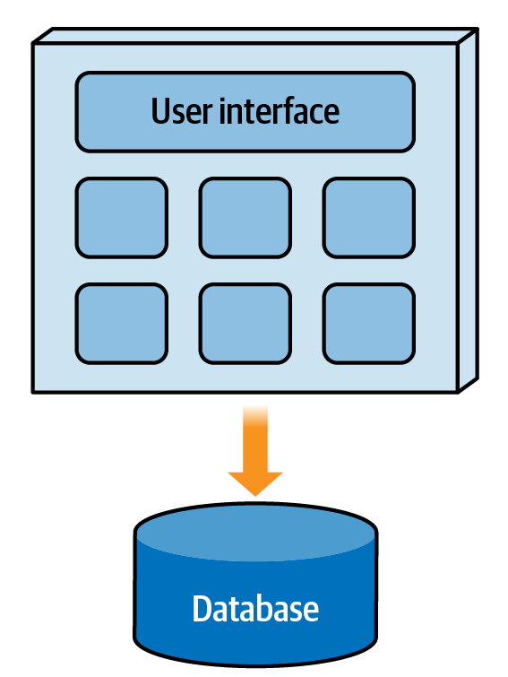
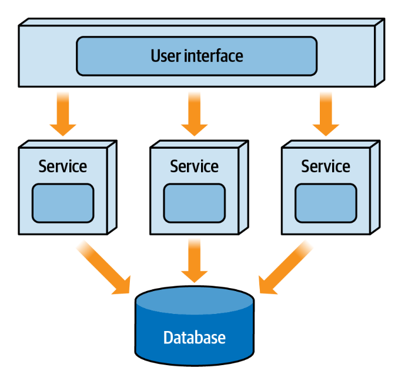
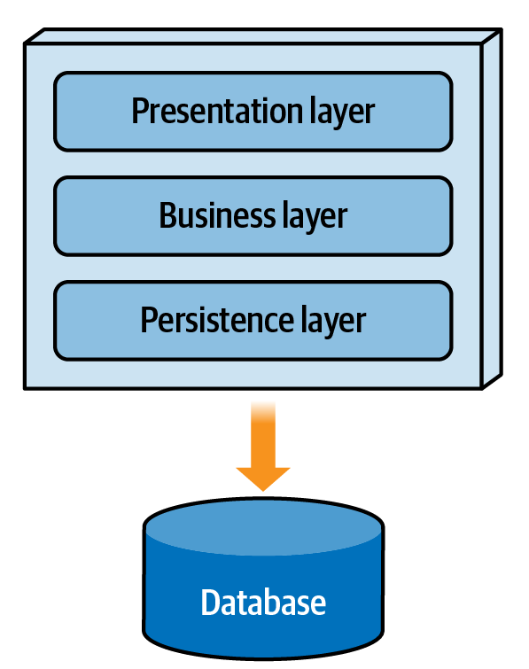
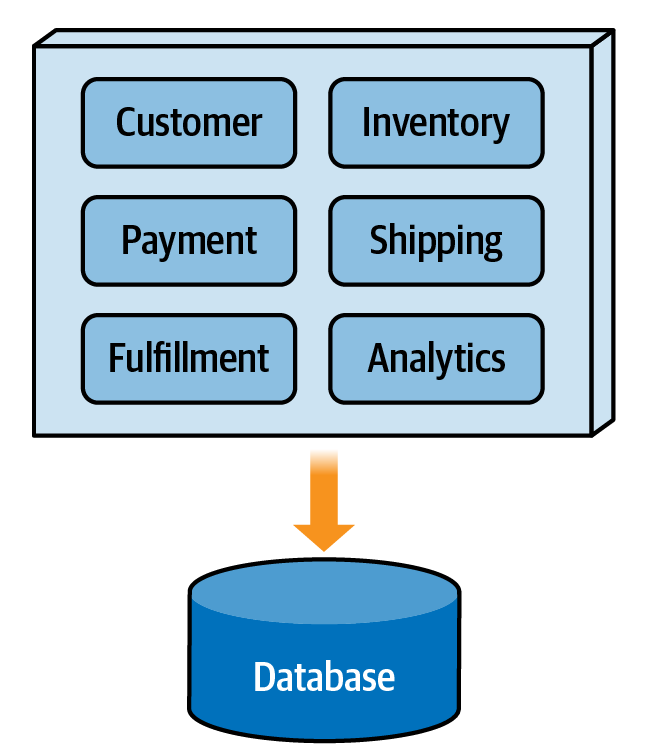

Chapter 2. Architectural Structures and Styles
Architecture styles allow you to use existing and well-known structures that support certain architectural characteristics (also known as nonfunctional quality attributes, system quality attributes, or “-ilities”). They not only provide you with a head start on defining an architecture for a given system, but they also facilitate communication among developers, architects, quality assurance testers, operations experts, and even in some cases, business stakeholders.

Architecture Classification
Architecture styles are classified as belonging to one of two main architectural structures: monolithic (single deployment unit) and distributed (multiple deployment units, usually consisting of services). This classification is important to understand because as a group, distributed architectures support much different architecture characteristics than monolithic ones. Knowing which classification of architecture to use is the first step in selecting the right architecture for your business problem.

Monolithic Architectures
Monolithic architecture styles (as illustrated in Figure 2-1) are generally much simpler than distributed ones, and as such are easier to design and implement. These single deployment unit applications are fairly inexpensive from an overall cost standpoint. Furthermore, most applications architected using a monolithic architecture style can be developed and deployed much more quickly than distributed ones.

\
\
Figure 2-1. Monolithic architectures are single deployment units
While cost and simplicity are the main strong points of a monolithic architecture, operational characteristics such as scalability, fault tolerance, and elasticity are its weak points. A fatal error (such as an out of memory condition) in a monolithic architecture causes all of the functionality to fail. Furthermore, mean time to recovery (MTTR) and mean time to start (MTTS) are usually measured in minutes, meaning that once a failure does occur, it takes a long time for the application to start back up. These long startup times also impact scalability and elasticity. While scalability can sometimes be achieved through load balancing multiple instances of the application, the entire application functionality must scale, even if only a small portion of the overall application needs to scale. This is not only inefficient, but unnecessarily costly as well.

Examples of monolithic architecture styles include the layered architecture (described in Chapter 3), the modular monolith, the pipeline architecture, and the microkernel architecture (described in Chapter 4).

Distributed Architectures
As the name suggests, distributed architectures consist of multiple deployment units that work together to perform some sort of cohesive business function. In today’s world, most distributed architectures consist of services, although each distributed architecture style has its own unique formal name for a service. Figure 2-2 illustrates a typical distributed architecture.

\
\
Figure 2-2. Distributed architectures consist of multiple deployment units
The superpowers of distributed architectures usually fall within operational characteristics—things like scalability, elasticity, fault tolerance, and in some cases, performance. Scalability in these architecture styles is typically at the individual service level, as is elasticity. Hence, MTTS and MTTR are much smaller than with a monolithic application, measured usually in seconds (and in some cases milliseconds) rather than minutes.

Distributed architectures are well suited for supporting high levels of fault tolerance. If one service fails, in many cases other services can continue to service requests as if no fault happened. Services that do fail can recover very quickly—so quickly that at times an end user sometimes doesn’t even know the service had a fatal error.

Agility (the ability to respond quickly to change) is often another superpower of distributed architectures. Because application functionality is divided into separately deployed units of software, it is easier to locate and apply a change, the testing scope is reduced to only the service that is impacted, and deployment risk is significantly reduced because only the service impacted is typically deployed.

Unfortunately, with all those good features come some bad features as well. Distributed architectures are plagued with what are known as the fallacies of distributed computing, a set of eight things we believe to be true about networks and distributed computing, but are in fact false. Things like “the network is reliable,” “bandwidth is infinite,” and “latency is zero” all make distributed architectures not only hard to keep deterministic, but also hard to make completely reliable. Networks do fail, bandwidth is not infinite, and latency is not zero. These things are as real today as they were back in the late ’90s when they were coined.

In addition to the eight fallacies of distributed computing, other difficulties arise with distributed architectures. Distributed transactions, eventual consistency, workflow management, error handling, data synchronization, contract management, and a host of other complexities are all part of the world of distributed architecture. To top it off, all this complexity usually means much more cost from an overall initial implementation and ongoing maintenance cost than monolithic architectures. Suddenly, all of those great superpowers don’t sound so great anymore when you consider all the trade-offs of distributed architectures.

Examples of distributed architectures include event-driven architecture (described in Chapter 5), the ever-popular microservices architecture (described in Chapter 6), service-based architecture, service-oriented architecture, and space-based architecture (described in Chapter 7).

Which One Should I Choose?
When choosing between a monolithic versus a distributed architecture, one question to first ask yourself is if the system you are creating has different sets of architecture characteristics that must be supported. In other words, does the entire system need to scale and support high availability, or only parts of the system? Systems that contain multiple sets of different architecture characteristics generally call for a distributed architecture. A good example of this is customer-facing functionality requiring support for scalability, responsiveness, availability, and agility, and an administrative or backend processing functionality that doesn’t need any of those characteristics.

Simple systems or websites usually warrant the simpler and more cost-effective monolithic architecture style, whereas more complex systems that perform multiple business functions usually warrant more complex distributed architectures. Similarly, the “need for speed,” the need for high volumes of scalability, and the need for high fault tolerance are all characteristics that lend themselves toward distributed architectures.

Architecture Partitioning
Besides being classified as either monolithic or distributed, architectures can also be classified by the way the overall structure of the system is partitioned. Architectures, whether they are monolithic or distributed, can be either technically partitioned or domain partitioned. The following sections describe the differences between these partitioning structures and why it’s important to understand them.

\

Technically partitioned architectures have the components of the system organized by technical usage. The classic example of a technically partitioned architecture is the layered (n-tiered) architecture style (see Chapter 3). In this architecture style, components are organized by technical layers; for example, presentation components that have to do with the user interface, business layer components that have to do with business rules and core processing, persistence layer components that interact with the database, and the database layer containing the data for the system.

Notice in Figure 2-3 that the components of any given domain are spread across all of these technical layers. For example, the customer domain functionality resides in the presentation layer as customer screens, the business layer as customer logic, the presentation layer as customer queries, and the database layer as customer tables. Manifested as namespaces, these components would be organized as follows: app.presentation.customer, app.business.customer, app.persistence.customer, and so on. Notice how the second node in the namespace specifies the technical layering, and that the customer node is spread across those layers.

Technical Partitioning
Figure 2-3. In a technically partitioned architecture, components are grouped by their technical usage
Technically partitioned architectures are useful if a majority of your changes are isolated to a specific technical area in the application. For example, if you are constantly changing the look and feel of your user interface without changing the corresponding business rules, change is isolated to only one part of the architecture (in this case, the presentation layer). Similarly, if your business rules are constantly changing but there is no impact to the data layer or presentation layer, changes are isolated to the business layer of the architecture with no impact to other parts of the system.

However, imagine implementing a new requirement to add an expiration data to items for customer wish lists in a technically partitioned architecture. This type of change is considered a domain-based change (not a technical usage one), and impacts all of the layers of the architecture. To implement this change, you would need to add a new column to the wish list table in the database layer, change the corresponding SQL in the persistence layer, add the corresponding business rules to components in the business layer, change the contracts between the business and presentation layer, and finally change the screens in the presentation layer. Depending on the size of the system and the team structure, this simple change might involve the coordination of three to four different teams.

Examples of technically partitioned architectures include the layered architecture (Chapter 3), microkernel architecture (Chapter 4), pipeline architecture, event-driven architecture (Chapter 5), and space-based architecture (Chapter 7). Microkernel architecture is particularly interesting in that it’s the only architecture style that can be either technically partitioned or domain partitioned depending on how the plug-in components are used. For example, when the plug-in components are used as adapters or special configuration settings, it would be considered technically partitioned.

Domain Partitioning
Unlike technically partitioned architectures, components in domain partitioned architectures are organized by domain areas, not technical usage. This means that all of the functionality (presentation, business logic, and persistence logic) is grouped together for each domain and subdomain area in separate areas of the application. For domain partitioned architectures, components might be manifested through a namespace structure such as app.customer, app.shipping, app.payment, and so on. Notice that the second node represents the domain rather than a technical layer. As a matter of fact, domains can be further organized into technical layering if so desired, which might take the form app.customer.presentation, app.customer.business, and so on. Notice that even though the customer domain logic may be organized by technical usage, the primary structure (represented as the second node of the namespace) is still partitioned by domain. Figure 2-4 shows a typical example of a domain partitioned architecture.

Domain partitioned architectures have grown in popularity over the years in part due to the increased use and acceptance of domain-driven design, a software modeling and analysis technique coined by Eric Evans. Domain-driven design places an emphasis on the design of a domain rather than on complex workflows and technical components. This approach allows teams to collaborate closely with domain experts and focus on one key part of the system, thus developing software that closely resembles that domain functionality.

\
\
Figure 2-4. In a domain partitioned architecture, components are grouped by domain area
The clear advantage of domain partitioning within an architecture is that changes to a particular domain or subdomain are self-contained within a specific area of the system, allowing teams to pinpoint exactly the area of the system that requires the change.

Coming back to our implementation of expiration data for a customer’s wish list items, with domain partitioning the changes in code are isolated to only one small part of the system, making this type of change much more effective than with technical partitioning. Here, for example, changes would be isolated to the namespace starting with app.customer.wishlist, meaning that presentation logic, business logic, and persistence logic are all within the same area of the system. Maintenance is easier, testing is easier, and deployment is much less risky when these types of changes are done.

Examples of domain partitioned architectures include the microkernel architecture (Chapter 4), microservices architecture (Chapter 6), modular monolith architecture, and service-based architecture. As indicated earlier, microkernel architecture can be either technically partitioned or domain partitioned. If the plug-in components are used to extend the application by adding functionality, then it would be considered a domain partitioned architecture.

Which One Should I Choose?
The choice between a technically partitioned architecture and a domain partitioned architecture is an important one. The overall structure of the architecture must be aligned not only with the team structure, but also with the nature of the types of changes expected in the system in order to be successful and effective.

Technically partitioned architectures (whether monolithic or distributed) are well suited when your overall team structure is organized by those same technical usage areas. For example, if your development teams are organized as teams of user interface developers, backend developers, and database developers, technically partitioned architectures would be a good fit because the team structure matches the technical layers of the architecture. Technically partitioned architectures are also a natural fit when most of your expected changes are aligned with technical layers (for example, multiple user interfaces, changes to the look and feel of the system, swapping out one database for another, and so on).

If you are embarking on a new system and using a domain-driven design approach, then you should in turn consider a domain partitioned architecture. Also, domain partitioned architectures are a great fit if your teams are organized into cross-functional teams with specialization—in other words, single teams that are aligned with specific domain functionality and contain user interface developers, backend developers, and database developers all on the same physical team.

Domain partitioned architectures are also a good choice when you expect most of your changes to be domain scoped rather than technical usage scoped. This allows for much better agility (the ability to respond quickly to change) than with technically partitioned architectures. However, be careful when choosing a domain partitioned architecture if you have lots of changes to technical usage layers. For example, swapping out one database type for another or changing the entire user interface framework would be a difficult and time-consuming task in a domain partitioned architecture.