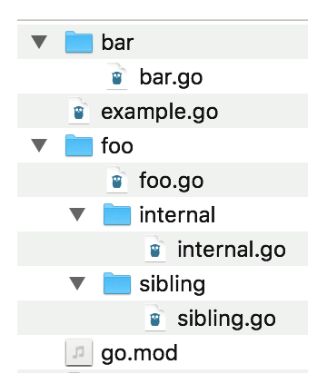

Most modern programming languages have a system for organizing code into namespaces and libraries, and Go is no exception. As we’ve seen while exploring other features, Go introduces some new approaches to this old idea. In this chapter, we’ll learn about organizing code with packages and modules, how to import them, how to work with third-party libraries, and how to create libraries of your own.

Repositories, Modules, and Packages
Library management in Go is based around three concepts: repositories, modules, and packages. A repository is familiar to all developers. It is a place in a version control system where the source code for a project is stored. A module is the root of a Go library or application, stored in a repository. Modules consist of one or more packages, which give the module organization and structure.

NOTE
While you can store more than one module in a repository, it isn’t encouraged. Everything within a module is versioned together. Maintaining two modules in one repository means tracking separate versions for two different projects in a single repository.

Before we can use code from packages outside of the standard library, we need to make sure that we have declared that our project is a module. Every module has a globally unique identifier. This is not unique to Go. Java uses globally unique package declarations like com.companyname.projectname.library.

In Go, we usually use the path to the module repository where the module is found. For example, Proteus, a module I wrote to simplify relational database access in Go, can be found at GitHub. It has a module path of github.com/jonbodner/proteus.

go.mod
A collection of Go source code becomes a module when there’s a valid go.mod file in its root directory. Rather than create this file manually, we use the subcommands of the go mod command to manage modules. The command go mod init MODULE_PATH creates the go.mod file that makes the current directory the root of a module. The MODULE_PATH is the globally unique name that identifies your module. The module path is case-sensitive. To reduce confusion, do not use uppercase letters within it.

Let’s take a quick look at the contents of a go.mod file:

module github.com/learning-go-book/money

go 1.15

require (
    github.com/learning-go-book/formatter v0.0.0-20200921021027-5abc380940ae
    github.com/shopspring/decimal v1.2.0
)
Every go.mod file starts with a module declaration that consists of the word module and the module’s unique path. Next, the go.mod file specifies the minimum compatible version of Go. Finally, the require section lists the modules that your module depends on and the minimum version required for each one. We’ll talk more about what those versions mean in “Importing Third-Party Code”. Omit the require section when your module doesn’t depend on any other modules.

There are two optional sections as well. The replace section lets you override the location where a dependent module is located, and the exclude section prevents a specific version of a module from being used.

Building Packages
Now that we’ve learned how to make our directory of code into a module, it’s time to start using packages to organize our code. We’ll start by looking at how import works, move on to creating and organizing packages, and then look at some of the features of Go’s packages, both good and bad.

Imports and Exports
We’ve been using the import statement in Go without discussing what it does and how it differs from other languages. Go’s import statement allows you to access exported constants, variables, functions, and types in another package. A package’s exported identifiers (an identifier is the name of a variable, constant, type, function, method, or a field in a struct) cannot be accessed from another current package without an import statement.

This leads to the question: how do you export an identifier in Go? Rather than use a special keyword, Go uses capitalization to determine if a package-level identifier is visible outside of the package where it is declared. An identifier whose name starts with an uppercase letter is exported. Conversely, an identifier whose name starts with a lowercase letter or underscore can only be accessed from within the package where it is declared.

Anything you export is part of your package’s API. Before you export an identifier, be sure that you intend to expose it to clients. Document all exported identifiers and keep them backward-compatible unless you are intentionally making a major version change (see “Versioning Your Module” for more information).

Creating and Accessing a Package
Making packages in Go is easy. Let’s look at a small program to demonstrate this. You can find it on GitHub. Inside package_example, you’ll see two additional directories, math and formatter. In math, there’s a file called math.go with the following contents:

package math

func Double(a int) int {
    return a * 2
}
The first line of the file is called the package clause. It consists of the keyword package and the name for the package. The package clause is always the first nonblank, noncomment line in a Go source file.

In formatter, there’s a file called formatter.go with the following contents:

package print

import "fmt"

func Format(num int) string {
    return fmt.Sprintf("The number is %d", num)
}
Note that we said the package name is print in the package clause, but it’s in the formatter directory. We’ll talk more about this in a bit.

Finally, the following contents are in the file main.go in the root directory:

package main

import (
    "fmt"

    "github.com/learning-go-book/package_example/formatter"
    "github.com/learning-go-book/package_example/math"
)

func main() {
    num := math.Double(2)
    output := print.Format(num)
    fmt.Println(output)
}
The first line of this file is familiar. All of our programs before this chapter have put package main as the first line in our code. We’ll talk more about what this means in just a bit.

Next we have our import section. We’re importing three packages. The first is fmt, which is in the standard library. We’ve done this in previous chapters. The next two imports refer to the packages within our program. You must specify an import path when importing from anywhere besides the standard library. The import path is built by appending the path to the package within the module to the module path.

It is a compile-time error to import a package but not use any of the identifiers exported by the package. This ensures that the binary produced by the Go compiler only includes code that’s actually used in the program.

WARNING
While you can use a relative path to import a dependent package within the same module, don’t do this. Absolute import paths clarify what you are importing and make it easier to refactor your code. You must fix the imports when a file with a relative path in its imports is moved to another package, and if you move that file to another module entirely, you must make the import reference absolute.

When you run this program, you’ll see the following output:

$ go run main.go
The number is 4
In our main function, we called the Double function in the math package by prefixing the function name with the package name. We’ve seen this in previous chapters when calling functions in the standard library. We also called the Format function in the print package. You might wonder where this print package came from, since we imported github.com/learning-go-book/package_example/formatter.

Every Go file in a directory must have an identical package clause. (There is one tiny exception to this rule that we’ll see in “Testing Your Public API”.) We imported the print package with the import path github.com/learning-go-book/package_example/formatter. That’s because the name of a package is determined by its package clause, not its import path.

As a general rule, you should make the name of the package match the name of the directory that contains the package. It is hard to discover a package’s name if it does not match the containing directory. However, there are a few situations where you use a different name for the package than for the directory.

The first is something we have been doing all along without realizing it. We declare a package to be a starting point for a Go application by using the special package name main. Since you cannot import the main package, this doesn’t produce confusing import statements.

The other reasons for having a package name not match your directory name are less common. If your directory name contains a character that’s not valid in a Go identifier, then you must choose a package name that’s different from your directory name. It’s better to avoid this by never creating a directory with a name that’s not a valid identifier.

The final reason for creating a directory whose name doesn’t match the package name is to support versioning using directories. We’ll talk about this more in “Versioning Your Module”.

Package names are in the file block. If you use the same package in two different files in the same package, you must import the package in both files.

Naming Packages
Having the package name as part of the name used to refer to items in the package has some implications. The first is that package names should be descriptive. Rather than have a package called util, create a package name that describes the functionality provided by the package. For example, say you have two helper functions: one to extract all names from a string and another to format names properly. Don’t create two functions in a util package called ExtractNames and FormatNames. If you do, every time you use these functions, they will be referred to as util.ExtractNames and util.FormatNames, and that util package tells you nothing about what the functions do.

It’s better to create one function called Names in a package called extract and a second function called Names in a package called format. It’s OK for these two functions to have the same name, because they will always be disambiguated by their package names. The first will be referred to as extract.Names when imported, and the second will be referred to as format.Names.

You should also avoid repeating the name of the package in the names of functions and types within the package. Don’t name your function ExtractNames when it is in the extract package. The exception to this rule is when the name of the identifier is the same as the name of the package. For example, the package sort in the standard library has a function called Sort, and the context package defines the Context interface.

How to Organize Your Module
There’s no one official way to structure the Go packages in your module, but several patterns have emerged over the years. They are guided by the principle that you should focus on making your code easy to understand and maintain. When your module is small, keep all of your code in a single package. As long as there are no other modules that depend on your module, there is no harm in delaying organization.

As your project grows, you’ll want to impose some order to make your code more readable. If your module consists of one or more applications, create a directory called cmd at the root of your module. Within cmd, create one directory for each binary built from your module. For example, you might have a module that contains both a web application and a command-line tool that analyzes data in the web application’s database. Use main as the package name within each of these directories.

If your module’s root directory contains many files for managing the testing and deployment of your project (such as shell scripts, continuous integration configuration files, or Dockerfiles), place all of your Go code (besides the main packages under cmd) into packages under a directory called pkg.

Within the pkg directory, organize your code to limit the dependencies between packages. One common pattern is to organize your code by slices of functionality. For example, if you wrote a shopping site in Go, you might place all of the code to support customer management in one package and all of the code to manage inventory in another. This style limits the dependencies between packages, which makes it easier to later refactor a single web application into multiple microservices.

For a good overview of Go project structure advice, watch Kat Zien’s talk from GopherCon 2018, How Do You Structure Your Go Apps.

Overriding a Package’s Name
Sometimes you might find yourself importing two packages whose names collide. For example, the standard library includes two packages for generating random numbers; one is cryptographically secure (crypto/rand) and the other is not (math/rand). The regular generator is fine when you aren’t generating random numbers for encryption, but you need to seed it with an unpredictable value. A common pattern is to seed a regular random number generator with a value from a cryptographic generator. In Go, both packages have the same name (rand). When that happens, you provide an alternate name for one package within the current file. You can try out this code on The Go Playground. First, look at the import section:

import (
    crand "crypto/rand"
    "encoding/binary"
    "fmt"
    "math/rand"
)
We import crypto/rand with the name crand. This overrides the name rand that’s declared within the package. We then import math/rand normally. When you look at the seedRand function, you see that we access identifiers in math/rand with the rand prefix, and use the crand prefix with the crypto/rand package:

func seedRand() *rand.Rand {
    var b [8]byte
    _, err := crand.Read(b[:])
    if err != nil {
        panic("cannot seed with cryptographic random number generator")
    }
    r := rand.New(rand.NewSource(int64(binary.LittleEndian.Uint64(b[:]))))
    return r
}
NOTE
There are two other symbols you can use as a package name. The package name . places all the exported identifiers in the imported package into the current package’s namespace; you don’t need a prefix to refer to them. This is discouraged because it makes your source code less clear as you no longer know whether something is defined in the current package or an imported one by simply looking at its name.

You can also use _ as the package name. We’ll explore what this does when we talk about init in “The init Function: Avoid if Possible”.

As we discussed in “Shadowing Variables”, package names can be shadowed. Declaring variables, types, or functions with the same name as a package makes the package inaccessible within the block with that declaration. If this is unavoidable (for example, a newly imported package has a name that conflicts with an existing identifier), override the package’s name to resolve the conflict.

Package Comments and godoc
Go has its own format for writing comments that are automatically converted into documentation. It’s called godoc format and it’s very simple. There are no special symbols in a godoc comment. They just follow a convention. Here are the rules:

Place the comment directly before the item being documented with no blank lines between the comment and the declaration of the item.

Start the comment with two forward slashes (//) followed by the name of the item.

Use a blank comment to break your comment into multiple paragraphs.

Insert preformatted comments by indenting the lines.

Comments before the package declaration create package-level comments. If you have lengthy comments for the package (such as the extensive formatting documentation in the fmt package), the convention is to put the comments in a file in your package called doc.go.

Let’s go through a well-commented file. We’ll start with the package-level comment in Example 9-1.

Example 9-1. A package-level comment
// Package money provides various utilities to make it easy to manage money.
package money
Next, we place a comment on an exported struct (see Example 9-2). Notice that it starts with the name of the struct.

Example 9-2. A struct comment
// Money represents the combination of an amount of money
// and the currency the money is in.
type Money struct {
    Value decimal.Decimal
    Currency string
}
Finally, we have a comment on a function (see Example 9-3).

Example 9-3. A well-commented function
// Convert converts the value of one currency to another.
//
// It has two parameters: a Money instance with the value to convert,
// and a string that represents the currency to convert to. Convert returns
// the converted currency and any errors encountered from unknown or unconvertible
// currencies.
// If an error is returned, the Money instance is set to the zero value.
//
// Supported currencies are:
//        USD - US Dollar
//        CAD - Canadian Dollar
//        EUR - Euro
//        INR - Indian Rupee
//
// More information on exchange rates can be found
// at https://www.investopedia.com/terms/e/exchangerate.asp
func Convert(from Money, to string) (Money, error) {
    // ...
}
Go includes a command-line tool called go doc that views godocs. The command go doc PACKAGE_NAME displays the package godocs for the specified package and a list of the identifiers in the package. Use go doc PACKAGE_NAME.IDENTIFIER_NAME to display the documentation for a specific identifier in the package.

TIP
Make sure you comment your code properly. At the very least, any exported identifier should have a comment. Go linting tools such as golint and golangci-lint can report missing comments on exported identifiers.

The internal Package
Sometimes you want to share a function, type, or constant between packages in your module, but you don’t want to make it part of your API. Go supports this via the special internal package name.

When you create a package called internal, the exported identifiers in that package and its subpackages are only accessible to the direct parent package of internal and the sibling packages of internal. Let’s look at an example to see how this works. You can find the code on GitHub. The directory tree is shown in Figure 9-1.

We’ve declared a simple function in the internal.go file in the internal package:

func Doubler(a int) int {
    return a * 2
}
We can access this function from foo.go in the foo package and from sibling.go in the sibling package.

\
\
Figure 9-1. The file tree for internal_package_example
Be aware that attempting to use the internal function from bar.go in the bar package or from example.go in the root package results in a compilation error:

$ go build ./...
package github.com/learning-go-book/internal_example
example.go:3:8: use of internal package
github.com/learning-go-book/internal_example/foo/internal not allowed

package github.com/learning-go-book/internal_example/bar
bar/bar.go:3:8: use of internal package
github.com/learning-go-book/internal_example/foo/internal not allowed
The init Function: Avoid if Possible
When you read Go code, it is usually clear which methods and functions are invoked and when they are called. One of the reasons why Go doesn’t have method overriding or function overloading is to make it easier to understand what code is running. However, there is a way to set up state in a package without explicitly calling anything: the init function. When you declare a function named init that takes no parameters and returns no values, it runs the first time the package is referenced by another package. Since init functions do not have any inputs or outputs, they can only work by side effect, interacting with package-level functions and variables.

The init function has another unique feature. Go allows you to declare multiple init functions in a single package, or even in a single file in a package. There’s a documented order for running multiple init functions in a single package, but rather than remembering it, it’s better to simply avoid them.

Some packages, like database drivers, use init functions to register the database driver. However, you don’t use any of the identifiers in the package. As mentioned earlier, Go doesn’t allow you to have unused imports. To work around this, Go allows blank imports, where the name assigned to an import is the underscore (_). Just as an underscore allows you to skip an unused return value from a function, a blank import triggers the init function in a package but doesn’t give you access to any of the exported identifiers in the package:

import (
    "database/sql"

    _ "github.com/lib/pq"
)
This pattern is considered obsolete because it’s unclear that a registration operation is being performed. Go’s compatibility guarantee for its standard library means that we are stuck using it to register database drivers and image formats, but if you have a registry pattern in your own code, register your plug-ins explicitly.

The primary use of init functions today is to initialize package-level variables that can’t be configured in a single assignment. It’s a bad idea to have mutable state at the top level of a package, since it makes it harder to understand how data flows through your application. That means that any package-level variables configured via init should be effectively immutable. While Go doesn’t provide a way to enforce that their value does not change, you should make sure that your code does not change them. If you have package-level variables that need to be modified while your program is running, see if you can refactor your code to put that state into a struct that’s initialized and returned by a function in the package.

There are a couple of additional caveats on the use of init. You should only declare a single init function per package, even though Go allows you to define multiple. If your init function loads files or accesses the network, document this behavior, so that security-conscious users of your code aren’t surprised by unexpected I/O.

Circular Dependencies
Two of the goals of Go are a fast compiler and easy to understand source code. To support this, Go does not allow you to have a circular dependency between packages. This means that if package A imports package B, directly or indirectly, package B cannot import package A, directly or indirectly. Let’s look at a quick example to explain the concept. You can download the code from GitHub. Our project has two sub-directories, pet and person. In pet.go in the pet package, we import github.com/learning-go-book/circular_dependency_example/person:

var owners = map[string]person.Person{
    "Bob":     {"Bob", 30, "Fluffy"},
    "Julia": {"Julia", 40, "Rex"},
}
While in person.go in the person package, we import github.com/learning-go-book/circular_dependency_example/pet:

var pets = map[string]pet.Pet{
    "Fluffy": {"Fluffy", "Cat", "Bob"},
    "Rex":    {"Rex", "Dog", "Julia"},
}
If you try to build this project, you’ll get an error:

$ go build
package github.com/learning-go-book/circular_dependency_example
    imports github.com/learning-go-book/circular_dependency_example/person
    imports github.com/learning-go-book/circular_dependency_example/pet
    imports github.com/learning-go-book/circular_dependency_example/person:
        import cycle not allowed
If you find yourself with a circular dependency, you have a few options. In some cases, this is caused by splitting packages up too finely. If two packages depend on each other, there’s a good chance they should be merged into a single package. We can merge our person and pet packages into a single package and that solves our problem.

If you have a good reason to keep your packages separated, it may be possible to move just the items that cause the circular dependency to one of the two packages or to a new package.

Gracefully Renaming and Reorganizing Your API
After using a module for a while, you might realize that its API is not ideal. You might want to rename some of the exported identifiers or move them to another package within your module. To avoid a backward-breaking change, don’t remove the original identifiers; provide an alternate name instead.

With a function or method, this is easy. You declare a function or method that calls the original. For a constant, simply declare a new constant with the same type and value, but a different name.

When you want to rename or move an exported type, you have to use an alias. Quite simply, an alias is a new name for a type. We saw in Chapter 7 how to use the type keyword to declare a new type based on an existing one. We also use the type keyword to declare an alias. Let’s say we have a type called Foo:

type Foo struct {
    x int
    S string
}

func (f Foo) Hello() string {
    return "hello"
}

func (f Foo) goodbye() string {
    return "goodbye"
}
If we want to allow users to access Foo by the name Bar, all we need to do is:

type Bar = Foo
To create an alias, we use the type keyword, the name of the alias, an equals sign, and the name of the original type. The alias has the same fields and methods as the original type.

The alias can even be assigned to a variable of the original type without a type conversion:

func MakeBar() Bar {
    bar := Bar{
        x: 20,
        S: "Hello",
    }
    var f Foo = bar
    fmt.Println(f.Hello())
    return bar
}
One important point to remember: an alias is just another name for a type. If you want to add new methods or change the fields in an aliased struct, you must add them to the original type.

You can alias a type that’s defined in the same package as the original type or in a different package. You can even alias a type from another module. There is one drawback to an alias in another package: you cannot use an alias to refer to the unexported methods and fields of the original type. This limitation makes sense, as aliases exist to allow a gradual change to a package’s API, and the API only consists of the exported parts of the package. To work around this limitation, call code in the type’s original package to manipulate unexported fields and methods.

There are two kinds of exported identifiers that can’t have alternate names. The first is a package-level variable. The second is a field in a struct. Once you choose a name for an exported struct field, there’s no way to create an alternate name.

Working with Modules
We’ve seen how to work with packages within a single module, and now it’s time to see how to integrate with other modules and the packages within them. After that, we’ll learn about publishing and versioning our own modules and Go’s centralized services: pkg.go.dev, the module proxy, and the sum database.

Importing Third-Party Code
So far, we’ve imported packages from the standard library like fmt, errors, os, and math. Go uses the same import system to integrate packages from third parties. Unlike many other compiled languages, Go compiles all code for your application into a single binary, whether it was code you wrote or code from third parties. Just as we saw when we imported a package from within our own project, when you import a third-party package, you specify the location in the source code repository where the package is located.

Let’s look at an example. We mentioned back in Chapter 2 that you should never use floating point numbers when you need an exact representation of a decimal number. If you do need an exact representation, one good library is the decimal module from ShopSpring. We are also going to look at a simple formatting library that I’ve written for this book. We’ll use both of these modules in a small program that accurately calculates the price of an item with the tax included and prints the output in a neat format. The following code is in main.go:

package main

import (
    "fmt"
    "log"
    "os"

    "github.com/learning-go-book/formatter"
    "github.com/shopspring/decimal"
)

func main() {
    if len(os.Args) < 3 {
        fmt.Println("Need two parameters: amount and percent")
        os.Exit(1)
    }
    amount, err := decimal.NewFromString(os.Args[1])
    if err != nil {
        log.Fatal(err)
    }
    percent, err := decimal.NewFromString(os.Args[2])
    if err != nil {
        log.Fatal(err)
    }
    percent = percent.Div(decimal.NewFromInt(100))
    total := amount.Add(amount.Mul(percent)).Round(2)
    fmt.Println(formatter.Space(80, os.Args[1], os.Args[2],
                                total.StringFixed(2)))
}
The two imports github.com/learning-go-book/formatter and github.com/shopspring/decimal specify third-party imports. Note that they include the location of the package in the repository. Once imported, we access the exported items in these packages just like any other imported package.

Before we build our application, look at the go.mod file. Its contents should be:

module github.com/learning-go-book/money

go 1.15
Do a build and we’ll see what happens:

$ go build
go: finding module for package github.com/shopspring/decimal
go: finding module for package github.com/learning-go-book/formatter
go: found github.com/learning-go-book/formatter in
    github.com/learning-go-book/formatter v0.0.0-20200921021027-5abc380940ae
go: found github.com/shopspring/decimal in github.com/shopspring/decimal v1.2.0
Because the location of the package is in the source code, go build is able to get the package’s module and download it. If you look in the go.mod file now, you’ll see:

module github.com/learning-go-book/money

go 1.15

require (
    github.com/learning-go-book/formatter v0.0.0-20200921021027-5abc380940ae
    github.com/shopspring/decimal v1.2.0
)
The require section of the go.mod file lists the modules that you’ve imported into your module. After the module name is a version number. In the case of the formatter module, it doesn’t have a version tag, so Go makes up a pseudo-version.

Meanwhile, a go.sum file has been created with the contents:

github.com/google/go-cmp v0.5.2/go.mod h1:v8dTdLbMG2kIc/vJvl+f65V22db...
github.com/learning-go-book/formatter v0.0.0-20200921021027-5abc38094...
github.com/learning-go-book/formatter v0.0.0-20200921021027-5abc38094...
github.com/shopspring/decimal v1.2.0 h1:abSATXmQEYyShuxI4/vyW3tV1MrKA...
github.com/shopspring/decimal v1.2.0/go.mod h1:DKyhrW/HYNuLGql+MJL6WC...
golang.org/x/xerrors v0.0.0-20191204190536-9bdfabe68543/go.mod h1:I/5...
Whenever you run any go command that requires dependencies (such as go run, go build, go test, or even go list), any imports that aren’t already in go.mod are downloaded to a cache. The go.mod file is automatically updated to include the module path that contains the package and the version of the module. The go.sum file is updated with two entries: one with the module, its version, and a hash of the module, the other with the hash of the go.mod file for the module. We’ll see what these hashes are used for in “Module Proxy Servers”.

Let’s validate that our code works by passing it some arguments:

$ ./money 99.99 7.25
99.99           7.25                                                 107.24
NOTE
Our sample program was checked in without go.sum and with an incomplete go.mod. This was done so you could see what happens when these files are populated. When committing your own projects to source control, always include up-to-date go.mod and go.sum files. Doing so specifies exactly what versions of your dependencies are being used.

Working with Versions
Let’s see how Go’s module system uses versions. I’ve written a simple module that we’re going to use in another tax collection program. In main.go, we have the following third-party imports:

"github.com/learning-go-book/simpletax"
"github.com/shopspring/decimal"
Like before, our sample program wasn’t checked in with go.mod and go.sum updated, so we could see what happens. When we build our program, we see the following:

$ go build
go: finding module for package github.com/learning-go-book/simpletax
go: finding module for package github.com/shopspring/decimal
go: downloading github.com/learning-go-book/simpletax v1.1.0
go: found github.com/learning-go-book/simpletax in
    github.com/learning-go-book/simpletax v1.1.0
go: found github.com/shopspring/decimal in github.com/shopspring/decimal v1.2.0
The go.mod file has been updated to:

module region_tax

go 1.15

require (
    github.com/learning-go-book/simpletax v1.1.0
    github.com/shopspring/decimal v1.2.0
)
We also have a go.sum with hashes for our dependencies. Let’s run our code and see if it’s working:

$ ./region_tax 99.99 12345
unknown zip: 12345
That looks like a wrong answer. There might be a bug in this latest version of the library. By default, Go picks the latest version of a dependency when you add it to your project. However, one of the things that makes versioning useful is that you can specify an earlier version of a module. First we can see what versions of the module are available with the go list command:

$ go list -m -versions github.com/learning-go-book/simpletax
github.com/learning-go-book/simpletax v1.0.0 v1.1.0
By default, the go list command lists the packages that are used in your project. The -m flag changes the output to list the modules instead, and the -versions flag changes go list to report on the available versions for the specified module. In this case, we see that there are two versions, v1.0.0 and v1.1.0. Let’s downgrade to version v1.0.0 and see if that fixes our problem. We do that with the go get command:

$ go get github.com/learning-go-book/simpletax@v1.0.0
The go get command lets us work with modules, updating the versions of our dependencies.

Now if we look at go.mod, we’ll see the version has been changed:

module region_tax

go 1.15

require (
    github.com/learning-go-book/simpletax v1.0.0
    github.com/shopspring/decimal v1.2.0
)
We also see in go.sum that it contains both versions of simpletax:

github.com/learning-go-book/simpletax v1.0.0 h1:iH+7ADkdyrSqrMR2GzuWS...
github.com/learning-go-book/simpletax v1.0.0/go.mod h1:/YqHwHy95m0M4Q...
github.com/learning-go-book/simpletax v1.1.0 h1:Z/6s1ydS/vjblI6PFuDEn...
github.com/learning-go-book/simpletax v1.1.0/go.mod h1:/YqHwHy95m0M4Q...
This is fine; if you change a module’s version, or even remove a module from your project, there still might be an entry for it in go.sum. This doesn’t cause any problems.

When we build and run our code again, the bug is fixed:

$ go build
$ ./region_tax 99.99 12345
107.99
NOTE
You might see dependencies labeled // indirect in your go.mod file. These are dependencies that aren’t declared in your project directly. There are a few reasons why they are added to your go.mod file. One reason is that your project depends on an older module that doesn’t have a go.mod file or the go.mod file has an error and is missing some of its dependencies. When building with modules, all dependencies must be listed in a go.mod file. Since the dependency declarations have to go somewhere, your go.mod is modified.

An indirect declaration might also be present if a direct dependency properly specifies the indirect dependency, but it specifies an older version than what’s installed in your project. This happens when you explicitly update an indirect dependency with go get or downgrade a dependency’s version.

SEMANTIC VERSIONING
Software has had version numbers from time immemorial, but there has been little consistency in what version numbers mean. The version numbers attached to Go modules follow the rules of semantic versioning, also known as SemVer. By requiring semantic versioning for modules, Go makes its module management code simpler while ensuring that users of a module understand what a new release promises.

If you aren’t familiar with SemVer, check out the full specification. The very short explanation is that semantic versioning divides a version number into three parts: the major version, the minor version, and the patch version, which are written as major.minor.patch and preceded by a v. The patch version number is incremented when fixing a bug, the minor version number is incremented (and the patch version is set back to 0) when a new, backward-compatible feature is added, and the major version number is incremented (and minor and patch are set back to 0) when making a change that breaks backward compatibility.

Minimal Version Selection
At some point, your project will depend on two or more modules that all depend on the same module. As often happens, these modules declare that they depend on different minor or patch versions of that module. How does Go resolve this?

The module system uses the principle of minimal version selection. This means that you will always get the lowest version of a dependency that is declared to work in all of the go.mod files across all of your dependencies. Let’s say that your module directly depends on modules A, B, and C. All three of these modules depend on module D. The go.mod file for module A declares that it depends on v1.1.0, module B declares that it depends on v1.2.0, and module C declares that it depends on v1.2.3. Go will import module D only once, and it will choose version v1.2.3, as that, in the words of the Go Modules Reference, is the minimum version that satisfies all requirements.

However, as sometimes happens, you might find that while module A works with version v1.1.0 of module D, it does not work with version v1.2.3. What do you do then? Go’s answer is that you need to contact the module authors to fix their incompatibilities. The import compatibility rule says that all minor and patch versions of a module must be backward compatible. If they aren’t, it’s a bug. In our example, either module D needs to be fixed because it broke backward compatibility, or module A needs to be fixed because it made a faulty assumption about the behavior of module D.

This isn’t the most satisfying answer, but it’s the most honest. Some build systems, like npm, will include multiple versions of the same package. This can introduce its own set of bugs, especially when there is package-level state. It also increases the size of your application. In the end, some things are better solved by community than code.

Updating to Compatible Versions
What about the case where you explicitly want to upgrade a dependency? Let’s assume that after we wrote our initial program, there are three more versions of simpletax. The first fixes problems in the initial v1.1.0 release. Since it’s a bug patch release with no new functionality, it would be released as v1.1.1. The second keeps the current functionality, but also adds a new function. It would get the version number v1.2.0. Finally, the third fixes a bug that was found in version v1.2.0. It has the version number v1.2.1.

To upgrade to the bug patch release for the current minor version, use the command go get -u=patch github.com/learning-go-book/simpletax. Since we had downgraded to v1.0.0, we would remain on that version, since there is no patch version with the same minor version.

If we upgraded to version v1.1.0 using go get github.com/learning-go-book/simpletax@v1.1.0 and then ran go get -u=patch github.com/learning-go-book/simpletax, we would be upgraded to version v1.1.1.

Finally, use the command go get -u github.com/learning-go-book/simpletax to get the most recent version of simpletax. That upgrades us to version v1.2.1.

Updating to Incompatible Versions
Let’s go back to our program. We’re expanding to Canada, and luckily, there’s a version of the simpletax module that handles both the US and Canada. However, this version has a slightly different API than the previous one, so its version is v2.0.0.

To handle incompatibility, Go modules follow the semantic import versioning rule. There are two parts to this rule:

The major version of the module must be incremented.

For all major versions besides 0 and 1, the path to the module must end in vN, where N is the major version.

The path changes because an import path uniquely identifies a package and, by definition, incompatible versions of a package are not the same package. Using different paths means that you can import two incompatible versions of a package into different parts of your program, allowing you to upgrade gracefully.

Let’s see how this changes our program. First, we are going to change our import of simpletax to:

"github.com/learning-go-book/simpletax/v2"
This changes our import to refer to the v2 module.

Next, we’re going to change the code in main to the following:

func main() {
    amount, err := decimal.NewFromString(os.Args[1])
    if err != nil {
        log.Fatal(err)
    }
    zip := os.Args[2]
    country := os.Args[3]
    percent, err := simpletax.ForCountryPostalCode(country, zip)
    if err != nil {
        log.Fatal(err)
    }
    total := amount.Add(amount.Mul(percent)).Round(2)
    fmt.Println(total)
}
We are now reading a third parameter from the command line, which is the country code, and we call a different function in the simpletax package. When we call go build, our dependency is automatically updated:

$ go build
go: finding module for package github.com/learning-go-book/simpletax/v2
go: downloading github.com/learning-go-book/simpletax/v2 v2.0.0
go: found github.com/learning-go-book/simpletax/v2 in
    github.com/learning-go-book/simpletax/v2 v2.0.0
We can run the program and see our new output:

$ ./region_tax 99.99 M4B1B4 CA
112.99
$ ./region_tax 99.99 12345 US
107.99
We can look at the go.mod file and we’ll see that the new version of simpletax is included:

module region_tax

go 1.15

require (
    github.com/learning-go-book/simpletax v1.0.0 // indirect
    github.com/learning-go-book/simpletax/v2 v2.0.0
    github.com/shopspring/decimal v1.2.0
)
And go.sum has been updated as well:

github.com/learning-go-book/simpletax v1.0.0 h1:iH+7ADkdyrSqrMR2GzuWS...
github.com/learning-go-book/simpletax v1.0.0/go.mod h1:/YqHwHy95m0M4Q...
github.com/learning-go-book/simpletax v1.1.0 h1:Z/6s1ydS/vjblI6PFuDEn...
github.com/learning-go-book/simpletax v1.1.0/go.mod h1:/YqHwHy95m0M4Q...
github.com/learning-go-book/simpletax/v2 v2.0.0 h1:cZURCo1tEqdw/cJygg...
github.com/learning-go-book/simpletax/v2 v2.0.0/go.mod h1:DVMa7zPtIFG...
github.com/shopspring/decimal v1.2.0 h1:abSATXmQEYyShuxI4/vyW3tV1MrKA...
github.com/shopspring/decimal v1.2.0/go.mod h1:DKyhrW/HYNuLGql+MJL6WC...
The old versions of simpletax are still referenced, even though they are no longer used. While this doesn’t cause any problems, Go includes a command to remove unused versions:

go mod tidy
After running this command, you’ll see that the only version referenced in go.mod and go.sum is v2.0.0.

Vendoring
To ensure that a module always builds with identical dependencies, some organizations like to keep copies of their dependencies inside their module. This is known as vendoring. It’s enabled by running the command go mod vendor. This creates a directory called vendor at the top level of your module that contains all of your module’s dependencies.

If new dependencies are added to go.mod or versions of existing dependencies are upgraded with go get, you need to run go mod vendor again to update the vendor directory. If you forget to do this, go build, go run, and go test will refuse to run and display an error message.

Whether or not you want to vendor your dependencies is up to your organization. Older Go dependency management systems required it, but with the advent of Go modules and proxy servers (see “Module Proxy Servers” for details), the practice is falling out of favor. The advantage of vendoring is that you know exactly what third-party code is going to be used by your project. The downside is that it dramatically increases the size of your project in version control.

pkg.go.dev
While there isn’t a single centralized repository of Go modules, there is a single service that gathers together documentation on Go modules. The Go team has created a site called pkg.go.dev that automatically indexes open source Go projects. For each module, the package index publishes the godocs, the license used, the README, the module’s dependencies, and what open source projects depends on the module. You can see the info that pkg.go.dev has on our simpletax module in Figure 9-2.

Version information on https://pkg.go.dev
Figure 9-2. Use pkg.go.dev to find and learn about third-party modules
Additional Information
We’ve covered the most important parts of working with Go modules here, but you can learn more at the Go wiki page on Modules.

Publishing Your Module
Making your module available to other people is as simple as putting it in a version control system. This is true whether you are releasing your project as open source on a public version control system like GitHub or a private one that’s hosted within your organization. Since Go programs build from source code and use a repository path to identify themselves, there’s no need to explicitly upload your module to a central library repository, like you do for Maven Central or npm. Make sure you check in both your go.mod file and your go.sum file.

When releasing an open source module, you should include a file named LICENSE in the root of your repository that specifies the open source license under which you are releasing your code. It’s FOSS has a good resource for learning more about the various kinds of open source licenses.

Roughly speaking, you can divide open source licenses into two categories: permissive (which allows users of your code to keep their code private) and nonpermissive (which requires users of your code to make their code open source). While the license you choose is up to you, the Go community favors permissive licenses, such as BSD, MIT, and Apache. Since Go compiles third-party code directly into every application, the use of a nonpermissive license like the GPL would require people who use your code to release their code as open source as well. For many organizations, this is not acceptable.

One final note: do not write your own license. Few people will trust that it has been properly reviewed by a lawyer, and they can’t tell what claims you are making on their project.

Versioning Your Module
Whether your module is public or private, you must properly version your module so that it works correctly with Go’s module system. As long as you are adding functionality or patching bugs, the process is simple. Store your changes in your source code repository, then apply a tag that follows the semantic versioning rules we discussed in “Semantic Versioning”.

If you reach a point where you need to break backward compatibility, the process is more complicated. As we saw when we imported version 2 of the simpletax module, a backward-breaking change requires a different import path. There are a few steps to take.

First you need to choose a way to store your new version. Go supports two ways for creating the different import paths:

Create a subdirectory within your module named vN, where N is the major version of your module. For example, if you are creating version 2 of your module, call this directory v2. Copy your code into this subdirectory, including the README and LICENSE files.

Create a branch in your version control system. You can either put the old code on the branch or the new code. Name the branch vN if you are putting the new code on the branch, or vN-1 if you are putting the old code there. For example, if you are creating version 2 of your module and want to put version 1 code on the branch, name the branch v1.

After you decide how to store your new code, you need to change the import path in the code in your subdirectory or branch. The module path in your go.mod file must end with /vN, and all of the imports within your module must use /vN as well. Going through all of your code can be tedious, but Marwan Sulaiman has created a tool that automates the work. Once the paths are fixed, go ahead and implement your changes.

NOTE
Technically, you could just change go.mod and your import statements, tag your main branch with the latest version, and not bother with a subdirectory or versioned branch. However, this is not a good practice, as it will break Go code built with older versions of the language or third-party dependency managers.

When you are ready to publish your new code, place a tag on your repository that looks like vN.0.0. If you are using the subdirectory system or keeping the latest code on your main branch, tag the main branch. If you are placing your new code on a different branch, tag that branch instead.

You can find more details on updating your code to an incompatible version in the post Go Modules: v2 and Beyond on the Go Blog.

Module Proxy Servers
Rather than rely on a single, central repository for libraries, Go uses a hybrid model. Every Go module is stored in a source code repository, like GitHub or GitLab. But by default, go get doesn’t fetch code directly from source code repositories. Instead, it sends requests to a proxy server run by Google. This server keeps copies of every version of virtually all public Go modules. If a module or a version of a module isn’t present on the proxy server, it downloads the module from the module’s repository, stores a copy, and returns the module.

In addition to the proxy server, Google also maintains a sum database. It stores information on every version of every module. This includes the entries that appear in a go.sum file for the module at that version and a signed, encoded tree description that contains the record. Just as the proxy server protects you from a module or a version of a module being removed from the internet, the sum database protects you against modifications to a version of a module. This could be malicious (someone has hijacked a module and slipped in malicious code), or it could be inadvertent (a module maintainer fixes a bug or adds a new feature and reuses an existing version tag). In either case, you don’t want to use a module version that has changed because you won’t be building the same binary and don’t know what the effects are on your application.

Every time you download a module via go build, go test, or go get, the Go tools calculate a hash for the module and contact the sum database to compare the calculated hash to the hash stored for that module’s version. If they don’t match, the module isn’t installed.

Specifying a Proxy Server
Some people object to sending requests for third-party libraries to Google. There are a few options:

If you don’t mind a public proxy server, but don’t want to use Google’s, you can switch to GoCenter (which is run by JFrog) by setting the GOPROXY environment variable to https://gocenter.io,direct.

You can disable proxying entirely by setting the GOPROXY environment variable to direct. You’ll download modules directly from their repositories, but if you depend on a version that’s removed from the repository, you won’t be able to access it.

You can run your own proxy server. Both Artifactory and Sonatype have Go proxy server support built into their enterprise repository products. The Athens Project provides an open source proxy server. Install one of these products on your network and then point GOPROXY to the URL.

Private Repositories
Most organizations keep their code in private repositories. If you want to use a private module in another Go project, you can’t request it from Google’s proxy server. Go will fall back to checking the private repository directly, but you might not want to leak the names of private servers and repositories to external services.

If you are using your own proxy server, or if you have disabled proxying, this isn’t an issue. Running a private proxy server has some additional benefits. First, it speeds up downloading of third-party modules, as they are cached in your company’s network. If accessing your private repositories requires authentication, using a private proxy server means that you don’t have to worry about exposing authentication information in your CI/CD pipeline. The private proxy server is configured to authenticate to your private repositories (see the authentication configuration documentation for Athens), while the calls to the private proxy server are unauthenticated.

If you are using a public proxy server, you can set the GOPRIVATE environment variable to a comma-separated list of your private repositories. For example, if you set GOPRIVATE to:

GOPRIVATE=*.example.com,company.com/repo
Any module stored in a repository that’s located at any subdomain of example.com or at a URL that starts with company.com/repo will be downloaded directly.

Wrapping Up
In this chapter, we’ve learned how to organize code and interact with the ecosystem of Go source code. We’ve seen how modules work, how to organize your code into packages, how to use third-party modules, and how to release modules of your own. In the next chapter, we’re going to explore one of the signature features in Go: concurrency.